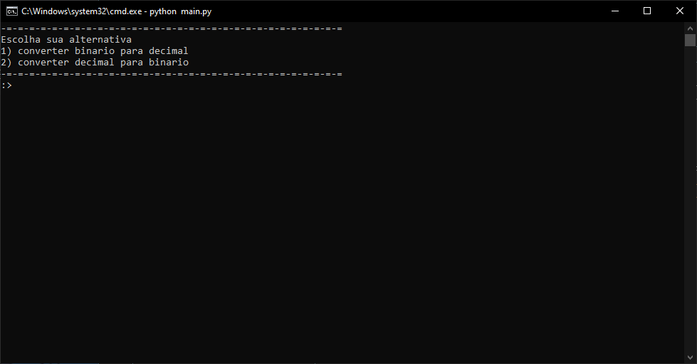

# Conversor_binario_python
um conversor de codigo binario para decimal e virse versa feito em python, feito com o objetivo de ser um conversor de codigo binario

# Como executar?

para executar o arquivo clone o repositorio com o comando `git clone https://github.com/LuizGafanhotos/Conversor_binario_python.git` 
se caso tiver o python instalado, basta ir na pasta que voce copiou o repositorio e digitar `python main.py` e resolvido

## Resultado:
